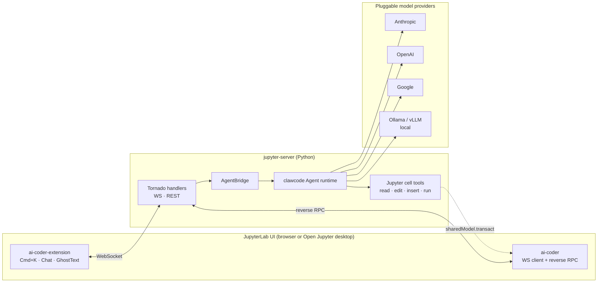

<div align="center">

<!--  -->


# Jupyter Studio

### The AI-Native JupyterLab.
### Open-source **Cursor for Notebooks** — agent inside every cell.

[](https://github.com/deepelementlab/jupyter-studio/stargazers)
[](LICENSE)
[](https://github.com/deepelementlab/jupyter-studio/releases)
[](https://github.com/deepelementlab/jupyter-studio/discussions)
[](https://github.com/deepelementlab)

<!---**[English](README.md)** · **[简体中文](README.zh-CN.md)** · **[Docs](https://github.com/deepelementlab/jupyter-studio/tree/main/docs)** · **[Discussions](https://github.com/deepelementlab/jupyter-studio/discussions)** · **[Roadmap](https://github.com/deepelementlab/jupyter-studio/projects)**-->

<br/>


<sub><i>Press <kbd>Cmd</kbd>+<kbd>K</kbd> in any cell. Chat with your whole notebook. Let the agent fix the traceback for you.</i></sub>

</div>

---

## ✨ Why Jupyter Studio?

Notebooks are how the world does data science, ML research, and quantitative work — but the AI tooling lives somewhere else. You either jump out to ChatGPT and copy-paste, or you leave Jupyter for an IDE and lose your kernels, plots, and state.


**Jupyter Studio brings the Cursor-class AI editing experience *into JupyterLab itself*** — same notebook, same kernel, same plots, now with an agent that can read your cells, run them, see the output, and edit them back.


- 🧠 **A real agent, not a chatbot** — multi-step plan → execute → verify loop, with cell-level tools (`read_cell`, `edit_cell`, `insert_cell`, `run_cell`, `read_output`).
- ⌨️ **Cmd+K inline edit** — select code, describe the change, accept the diff. Works inside any cell.
- 💬 **Chat that knows your notebook** — `@cell`, `@file`, slash commands, full notebook context, streaming responses.
- 👻 **Ghost Text completion** — Copilot-style inline completion native to JupyterLab.
- 🛠 **Auto-fix tracebacks** — one click on the 🐛 button after an error, the agent diagnoses and patches the cell.
- 🔌 **Bring your own model** — Anthropic, OpenAI, Google, Azure, Ollama, vLLM, any OpenAI-compatible endpoint.
- 🔒 **Local-first & privacy-first** — your code never leaves your machine unless *you* point the agent at a remote model. No telemetry by default.
- 🖥 **Desktop or browser** — ships as a JupyterLab extension *and* a native cross-platform desktop app.

> If you've ever wished JupyterLab had **Cursor / Continue / GitHub Copilot Chat** built in — this is that, free and open source.

---

## 🆚 How does it compare?

|                                  | **Jupyter Studio** | JupyterAI | GitHub Copilot in Jupyter | Cursor | VS Code + Jupyter Ext |
| -------------------------------- | :----------------: | :-------: | :-----------------------: | :----: | :-------------------: |
| Native JupyterLab UI             |         ✅         |    ✅     |             ✅            |   ❌   |          ⚠️          |
| Cmd+K inline edit                |         ✅         |    ❌     |             ⚠️           |   ✅   |          ❌          |
| Ghost-text completion            |         ✅         |    ❌     |             ✅            |   ✅   |          ✅          |
| **Multi-step agent**             |         ✅         |    ⚠️    |             ❌            |   ✅   |          ❌          |
| **Cell-aware tools** (read/edit/run cell) | ✅      |    ❌     |             ❌            |   ❌   |          ❌          |
| Auto-fix traceback               |         ✅         |    ❌     |             ❌            |   ⚠️  |          ❌          |
| Permission gating for risky ops  |         ✅         |    ❌     |             ❌            |   ⚠️  |          ❌          |
| Bring-your-own-model             |         ✅         |    ✅     |             ❌            |   ⚠️  |          ⚠️         |
| Local model support (Ollama/vLLM)|         ✅         |    ✅     |             ❌            |   ❌   |          ⚠️         |
| Self-hosted / fully open-source  |         ✅         |    ✅     |             ❌            |   ❌   |          ⚠️         |
| Free                             |         ✅         |    ✅     |             💲            |   💲  |          ✅         |

> Legend: ✅ first-class · ⚠️ partial / via plugin · ❌ not supported · 💲 paid

---

## ⚡ Quick start

### Option A — One-line installer (recommended)

```bash
# macOS / Linux
curl -fsSL https://raw.githubusercontent.com/deepelementlab/jupyter-studio/main/install.sh | bash

# Windows (PowerShell)
iwr -useb https://raw.githubusercontent.com/deepelementlab/jupyter-studio/main/install.ps1 | iex
```

This streams the repo’s [`install.sh`](install.sh) / [`install.ps1`](install.ps1) from the `main` branch (adjust the URL if your default branch differs). It creates a venv, installs the server extension, builds the JupyterLab assets, and (optionally) sets up the Open Jupyter desktop shell. The installer is idempotent — run it again any time.

### Option B — Use an existing JupyterLab

```bash
pip install jupyter-studio-ai
jupyter lab
```

That's it. Open any notebook and:

- Press <kbd>Cmd</kbd>/<kbd>Ctrl</kbd> + <kbd>K</kbd> in any cell → inline edit
- Click the ✨ icon in the right sidebar → chat
- Start typing → ghost-text suggestions
- After an error → click 🐛 *Fix with AI*

### Option C — Native desktop app

Download a one-click installer for your OS from the [Releases page](https://github.com/deepelementlab/jupyter-studio/releases/latest):

| Windows 10/11 | macOS 12+ | Linux |
| :---: | :---: | :---: |
| [`.exe`](https://github.com/deepelementlab/jupyter-studio/releases/latest) | [`.dmg` (arm64 / x64)](https://github.com/deepelementlab/jupyter-studio/releases/latest) | [`.deb` / `.rpm` / `.AppImage`](https://github.com/deepelementlab/jupyter-studio/releases/latest) |

---

## 📸 What you can do

<details>
<summary><b>1. Cmd+K in a cell — "make this vectorized"</b></summary>


Select code, hit `Cmd+K`, describe the change in natural language. Accept the diff with `Enter`, reject with `Esc`.
</details>

<details>
<summary><b>2. Agent fixes a traceback in 3 cells</b></summary>


The agent reads the error, looks at adjacent cells for context, edits the buggy cell, re-runs it, and reports back.
</details>

<details>
<summary><b>3. "Refactor the data loader across cells 3-7"</b></summary>


Multi-cell, multi-step refactors. The agent plans, edits each cell, runs them in order, and tells you what changed.
</details>

<details>
<summary><b>4. Chat with full notebook context using @cell and @file</b></summary>


`@cell:3` references a specific cell. `@file:data/train.csv` attaches a file. Slash commands like `/explain`, `/test`, `/plot` are first-class.
</details>

---

## 🏗 Architecture



Three packages, one repo:

| Package | What it is |
| --- | --- |
| [`clawcode/`](clawcode/) | The reusable agent runtime: tool calls, multi-step planning, streaming events. Pure Python. |
| [`jupyter_studio_ai/`](jupyter_studio_ai/) | The `jupyter_server` extension: WS/REST endpoints, agent bridge, cell tools. |
| [`open-jupyter/`](open-jupyter/) | The JupyterLab Desktop fork with the `@jupyterlab/ai-coder` and `@jupyterlab/ai-coder-extension` packages preinstalled. |

A deeper dive lives in [`JUPYTERLAB_AI_INTEGRATION.md`](JUPYTERLAB_AI_INTEGRATION.md).

---

## 🔌 Bring Your Own Model

Jupyter Studio is provider-agnostic. Configure once, switch any time.

```yaml
# ~/.jupyter/jupyter_studio_ai.yaml
default_model: claude-3-7-sonnet
providers:
  anthropic:
    api_key: ${ANTHROPIC_API_KEY}
  openai:
    api_key: ${OPENAI_API_KEY}
  google:
    api_key: ${GEMINI_API_KEY}
  ollama:
    base_url: http://localhost:11434
  # any OpenAI-compatible endpoint
  custom:
    base_url: https://your-gateway.internal/v1
    api_key: ${INTERNAL_KEY}
```

Local-only mode (no calls leave your machine):

```bash
export JUPYTER_STUDIO_MODEL=ollama/qwen2.5-coder:14b
jupyter lab
```

---

## 🛠 Developer quickstart

```bash
git clone https://github.com/deepelementlab/jupyter-studio.git
cd jupyter-studio

# Bootstrap everything (venv + python deps + lab build + desktop shell)
./install.sh             # macOS / Linux
./install.ps1            # Windows PowerShell

# Or step-by-step:
pip install -e ./clawcode
pip install -e ./jupyter_studio_ai
cd open-jupyter/jupyterlab-main && jlpm install && jlpm run build:dev
jupyter lab --dev-mode
```

See [`dev.md`](open-jupyter/dev.md) for the full developer workflow and [`JUPYTERLAB_AI_INTEGRATION.md`](JUPYTERLAB_AI_INTEGRATION.md) for the integration internals.

---

## 🗺 Roadmap

- [x] Cmd+K inline edit
- [x] Chat sidebar with `@cell` / `@file` context
- [x] Ghost-text completion
- [x] Multi-step agent with cell tools
- [x] Auto-fix tracebacks
- [x] Cross-platform desktop installer
- [ ] **Notebook-level diff & checkpoint** (Q2)
- [ ] **Variable inspector tool for the agent** (Q2)
- [ ] **Collaborative agent in RTC notebooks** (Q3)
- [ ] **Custom skill packs** (Q3)
- [ ] **VS Code parity for `.py` files inside Lab** (Q4)

Track everything live on the [public roadmap →](https://github.com/deepelementlab/jupyter-studio/projects)

---

## 🤝 Contributing

We love contributors. There are **[good-first-issues here](https://github.com/deepelementlab/jupyter-studio/labels/good%20first%20issue)** — most can be done in under 100 lines of code.

- 🐛 [Report a bug](https://github.com/deepelementlab/jupyter-studio/issues/new?template=bug.yml)
- 💡 [Request a feature](https://github.com/deepelementlab/jupyter-studio/issues/new?template=feature.yml)
- 📖 [Improve the docs](https://github.com/deepelementlab/jupyter-studio/tree/main/docs)
- 💬 [GitHub Discussions](https://github.com/deepelementlab/jupyter-studio/discussions) — ask questions and share ideas

Read [`CONTRIBUTING.md`](CONTRIBUTING.md) before you open a PR. Be kind, ship code, have fun.

---

## 💖 Sponsors & Used by

> *Logos appear here once your sponsors / users opt in.*

If your team relies on Jupyter Studio in production, we'd love to feature you. Open a PR adding your logo to [`docs/users.md`](docs/users.md), or [sponsor DeepElementLab on GitHub](https://github.com/sponsors/deepelementlab).

---

## ⭐ Star History

<a href="https://star-history.com/#deepelementlab/jupyter-studio&Date">
  
</a>

If Jupyter Studio saves you time, **[give it a star ⭐](https://github.com/deepelementlab/jupyter-studio)** — it genuinely helps more people discover the project.

---

## 📄 License & citation

Released under the **Apache 2.0 License**. See [`LICENSE`](LICENSE).

If you use Jupyter Studio in academic work, please cite:

```bibtex
@software{jupyter_studio_2026,
  title  = {Jupyter Studio: An AI-native JupyterLab},
  author = {The Jupyter Studio Authors},
  year   = {2026},
  url    = {https://github.com/deepelementlab/jupyter-studio}
}
```

---

<div align="center">

**Built by notebook nerds, for notebook nerds.**

<!--[Repository](https://github.com/deepelementlab/jupyter-studio) · [Docs tree](https://github.com/deepelementlab/jupyter-studio/tree/main/docs) · [Discussions](https://github.com/deepelementlab/jupyter-studio/discussions) · [Releases](https://github.com/deepelementlab/jupyter-studio/releases) · [Organization](https://github.com/deepelementlab)-->

[Repository](https://github.com/deepelementlab/jupyter-studio) · [Organization](https://github.com/deepelementlab)

</div>
