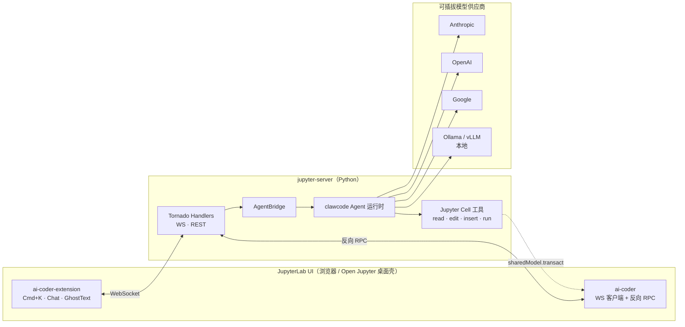

<div align="center">


# Jupyter Studio

### 原生 AI 的 JupyterLab。
### 开源版 **「Notebook 里的 Cursor」** —— 让 Agent 住进每一个 Cell。

[](https://github.com/deepelementlab/jupyter-studio/stargazers)
[](LICENSE)
[](https://github.com/deepelementlab/jupyter-studio/releases)
<!--[](https://github.com/deepelementlab/jupyter-studio/discussions)-->
<!--[](docs/assets/wechat-qr.png)-->
[](https://github.com/deepelementlab)

<!--**[English](README.md)** · **[简体中文](README.zh-CN.md)** · **[文档](https://github.com/deepelementlab/jupyter-studio/tree/main/docs)** · **[讨论区](https://github.com/deepelementlab/jupyter-studio/discussions)** · **[路线图](https://github.com/deepelementlab/jupyter-studio/projects)**-->

<br/>


<sub><i>在任意单元格按下 <kbd>Cmd</kbd>+<kbd>K</kbd>。与整个 Notebook 对话。让 Agent 帮你修掉报错。</i></sub>

</div>

---

## ✨ 为什么需要 Jupyter Studio？

数据科学、机器学习、量化研究的工作流仍然以 Notebook 为中心，但 AI 编码工具几乎都在 Notebook 之外——要么跳到 ChatGPT 复制粘贴，要么离开 Jupyter 去 IDE，于是丢掉了 Kernel、变量、图表、状态。


**Jupyter Studio 把 Cursor 级别的 AI 编码体验直接搬进了 JupyterLab**——同一个 Notebook、同一个 Kernel、同一张图，再加一个能读取、运行、改写你 Cell 的 Agent。


- 🧠 **真正的 Agent，不是聊天机器人** —— 多步「规划 → 执行 → 验证」闭环，自带 Cell 级工具：`read_cell` / `edit_cell` / `insert_cell` / `run_cell` / `read_output`。
- ⌨️ **Cmd+K 行内编辑** —— 选中代码，自然语言描述需求，回车接受 diff，Esc 拒绝。任何 Cell 都能用。
- 💬 **懂你 Notebook 的 Chat** —— 支持 `@cell` / `@file`、斜杠命令、整本上下文、流式输出。
- 👻 **Ghost Text 行内补全** —— Copilot 风格的灰字补全，JupyterLab 原生体验。
- 🛠 **一键修报错** —— Cell 执行出错后点 🐛 *Fix with AI*，Agent 自动定位 → 改写 → 重跑。
- 🔌 **自带模型自由切换** —— Anthropic / OpenAI / Google / Azure / Ollama / vLLM / 任意 OpenAI 兼容端点。
- 🔒 **本地优先、隐私优先** —— 默认不上报任何遥测；想完全本地跑就接 Ollama，代码一行都不出机。
- 🖥 **浏览器 / 桌面双形态** —— 既是 JupyterLab 扩展，也是跨平台桌面应用。

> 一句话：**如果你曾经希望 JupyterLab 内置 Cursor / Continue / Copilot Chat —— 这个项目就是。完全免费、完全开源。**

---

## 🆚 与其它方案的对比

|                                  | **Jupyter Studio** | JupyterAI | Copilot in Jupyter | Cursor | VSCode + Jupyter |
| -------------------------------- | :----------------: | :-------: | :----------------: | :----: | :--------------: |
| JupyterLab 原生 UI               |         ✅         |    ✅     |         ✅         |   ❌   |        ⚠️       |
| Cmd+K 行内编辑                   |         ✅         |    ❌     |         ⚠️        |   ✅   |        ❌       |
| Ghost Text 补全                  |         ✅         |    ❌     |         ✅         |   ✅   |        ✅       |
| **多步 Agent**                   |         ✅         |    ⚠️    |         ❌         |   ✅   |        ❌       |
| **Cell 级工具**（读/改/运行单元格）|       ✅         |    ❌     |         ❌         |   ❌   |        ❌       |
| 自动修复 Traceback               |         ✅         |    ❌     |         ❌         |   ⚠️  |        ❌       |
| 危险操作权限确认                  |         ✅         |    ❌     |         ❌         |   ⚠️  |        ❌       |
| 自带模型（BYO Model）             |         ✅         |    ✅     |         ❌         |   ⚠️  |        ⚠️      |
| 本地模型（Ollama / vLLM）         |         ✅         |    ✅     |         ❌         |   ❌   |        ⚠️      |
| 自部署 / 完全开源                |         ✅         |    ✅     |         ❌         |   ❌   |        ⚠️      |
| 免费                             |         ✅         |    ✅     |         💲         |   💲  |        ✅       |

> 图例：✅ 原生支持 · ⚠️ 部分支持 / 需插件 · ❌ 不支持 · 💲 收费

---

## ⚡ 30 秒上手

### 方式 A —— 一行安装（推荐）

```bash
# macOS / Linux
curl -fsSL https://raw.githubusercontent.com/deepelementlab/jupyter-studio/main/install.sh | bash

# Windows (PowerShell)
iwr -useb https://raw.githubusercontent.com/deepelementlab/jupyter-studio/main/install.ps1 | iex
```

脚本从仓库默认分支 **`main`** 上的 [`install.sh`](install.sh) / [`install.ps1`](install.ps1) 拉取安装（若你的默认分支不同，请改用对应的 raw 地址）。会自动创建 venv、安装 server 扩展、构建 JupyterLab 资产，并可选地装好 Open Jupyter 桌面壳。脚本幂等，可重复执行。

### 方式 B —— 已有 JupyterLab

```bash
pip install jupyter-studio-ai
jupyter lab
```

完事。打开任意 Notebook：

- 在 Cell 内按 <kbd>Cmd</kbd>/<kbd>Ctrl</kbd> + <kbd>K</kbd> → 行内编辑
- 点击右侧栏 ✨ 图标 → 打开 Chat
- 输入代码时 → 自动出现 Ghost Text 补全
- 出错后 → 点 🐛 *Fix with AI*

### 方式 C —— 桌面原生应用

到 [Releases 页面](https://github.com/deepelementlab/jupyter-studio/releases/latest) 下载对应系统的安装包：

| Windows 10/11 | macOS 12+ | Linux |
| :---: | :---: | :---: |
| [`.exe`](https://github.com/deepelementlab/jupyter-studio/releases/latest) | [`.dmg`（arm64 / x64）](https://github.com/deepelementlab/jupyter-studio/releases/latest) | [`.deb` / `.rpm` / `.AppImage`](https://github.com/deepelementlab/jupyter-studio/releases/latest) |

---

## 📸 它能做什么？

<details>
<summary><b>1. Cmd+K：「把这段改成向量化写法」</b></summary>


选中代码 → `Cmd+K` → 自然语言描述需求 → 看 diff → `Enter` 接受 / `Esc` 拒绝。
</details>

<details>
<summary><b>2. Agent 跨 3 个 Cell 修一次报错</b></summary>


Agent 读取报错 → 浏览相邻 Cell 找上下文 → 改写出错的那一格 → 重新运行 → 汇报结果。
</details>

<details>
<summary><b>3. 「重构第 3-7 格的数据加载逻辑」</b></summary>


跨多 Cell、多步骤的重构。Agent 先规划、再按顺序改写、运行，并告诉你改了什么。
</details>

<details>
<summary><b>4. 用 @cell / @file 把整本 Notebook 喂给 Chat</b></summary>


`@cell:3` 引用某个 Cell，`@file:data/train.csv` 附加文件。斜杠命令 `/explain`、`/test`、`/plot` 一等公民。
</details>

---

## 🏗 架构总览



仓库 = 3 个互相协作的包：

| 包 | 作用 |
| --- | --- |
| [`clawcode/`](clawcode/) | 可复用的 Agent 运行时：工具调用、多步规划、流式事件。纯 Python。 |
| [`jupyter_studio_ai/`](jupyter_studio_ai/) | `jupyter_server` 扩展：WS/REST 端点、Agent 桥接、Cell 工具。 |
| [`open-jupyter/`](open-jupyter/) | JupyterLab Desktop 分支，内置 `@jupyterlab/ai-coder` 与 `@jupyterlab/ai-coder-extension` 两个前端包。 |

更深入的集成内幕见 [`JUPYTERLAB_AI_INTEGRATION.md`](JUPYTERLAB_AI_INTEGRATION.md)。

---

## 🔌 自由切换模型

Jupyter Studio 与模型解耦，配置一次随时换：

```yaml
# ~/.jupyter/jupyter_studio_ai.yaml
default_model: claude-3-7-sonnet
providers:
  anthropic:
    api_key: ${ANTHROPIC_API_KEY}
  openai:
    api_key: ${OPENAI_API_KEY}
  google:
    api_key: ${GEMINI_API_KEY}
  ollama:
    base_url: http://localhost:11434
  # 任意 OpenAI 兼容端点
  custom:
    base_url: https://your-gateway.internal/v1
    api_key: ${INTERNAL_KEY}
```

完全本地模式（代码不出机）：

```bash
export JUPYTER_STUDIO_MODEL=ollama/qwen2.5-coder:14b
jupyter lab
```

---

## 🛠 开发者快速上手

```bash
git clone https://github.com/deepelementlab/jupyter-studio.git
cd jupyter-studio

# 一键 bootstrap（venv + Python 依赖 + Lab 构建 + 桌面壳）
./install.sh             # macOS / Linux
./install.ps1            # Windows PowerShell

# 或手工分步：
pip install -e ./clawcode
pip install -e ./jupyter_studio_ai
cd open-jupyter/jupyterlab-main && jlpm install && jlpm run build:dev
jupyter lab --dev-mode
```

完整开发流程见 [`dev.md`](open-jupyter/dev.md)，集成实现细节见 [`JUPYTERLAB_AI_INTEGRATION.md`](JUPYTERLAB_AI_INTEGRATION.md)。


---

## 🗺 路线图

- [x] Cmd+K 行内编辑
- [x] 支持 `@cell` / `@file` 的 Chat 侧栏
- [x] Ghost Text 行内补全
- [x] 带 Cell 工具的多步 Agent
- [x] 一键修复 Traceback
- [x] 跨平台桌面安装包
- [ ] **Notebook 级 diff 与 checkpoint**（Q2）
- [ ] **Agent 可用的变量查看器**（Q2）
- [ ] **多人协作 Notebook 中的 Agent**（Q3）
- [ ] **自定义 Skill Pack**（Q3）
- [ ] **Lab 内的 `.py` 文件 VS Code 级体验**（Q4）

实时追踪：[公开路线图 →](https://github.com/deepelementlab/jupyter-studio/projects)

---

## 🤝 参与贡献

我们超欢迎 PR！这里有一批 **[good-first-issue](https://github.com/deepelementlab/jupyter-studio/labels/good%20first%20issue)**，大多在 100 行以内就能完成。

- 🐛 [提交 Bug](https://github.com/deepelementlab/jupyter-studio/issues/new?template=bug.yml)
- 💡 [提 Feature Request](https://github.com/deepelementlab/jupyter-studio/issues/new?template=feature.yml)
- 📖 [改进文档](https://github.com/deepelementlab/jupyter-studio/tree/main/docs)
- 💬 [GitHub Discussions（讨论区）](https://github.com/deepelementlab/jupyter-studio/discussions) —— 提问与交流
- 🇨🇳 [中文微信群](docs/assets/wechat-qr.png) —— 扫码加入

开 PR 前请阅读 [`CONTRIBUTING.md`](CONTRIBUTING.md)。友好交流，写有趣的代码。

---

## 💖 赞助 & 使用者

> *赞助者 / 使用方 Logo 经过你授权后展示在此。*

如果你的团队在生产环境中使用 Jupyter Studio，欢迎把 Logo 加到 [`docs/users.md`](docs/users.md)；也可以通过 [GitHub Sponsors · DeepElementLab](https://github.com/sponsors/deepelementlab) 资助开发团队。

---

## ⭐ Star 历史

<a href="https://star-history.com/#deepelementlab/jupyter-studio&Date">
  
</a>

如果 Jupyter Studio 帮你节省了时间，**[请点一下 Star ⭐](https://github.com/deepelementlab/jupyter-studio)** —— 这是让更多人发现这个项目最有效的方式。

---

## 📄 许可证 & 引用

基于 **Apache 2.0** 协议开源，详见 [`LICENSE`](LICENSE)。

如果你在学术工作中使用 Jupyter Studio，欢迎引用：

```bibtex
@software{jupyter_studio_2026,
  title  = {Jupyter Studio: An AI-native JupyterLab},
  author = {The Jupyter Studio Authors},
  year   = {2026},
  url    = {https://github.com/deepelementlab/jupyter-studio}
}
```

---

<div align="center">

**由一群热爱 Notebook 的人，为热爱 Notebook 的人打造。**

<!--[仓库主页](https://github.com/deepelementlab/jupyter-studio) · [文档目录](https://github.com/deepelementlab/jupyter-studio/tree/main/docs) · [讨论区](https://github.com/deepelementlab/jupyter-studio/discussions) · [Releases](https://github.com/deepelementlab/jupyter-studio/releases) · [组织](https://github.com/deepelementlab)-->
[仓库主页](https://github.com/deepelementlab/jupyter-studio) ·  [组织](https://github.com/deepelementlab)
</div>
