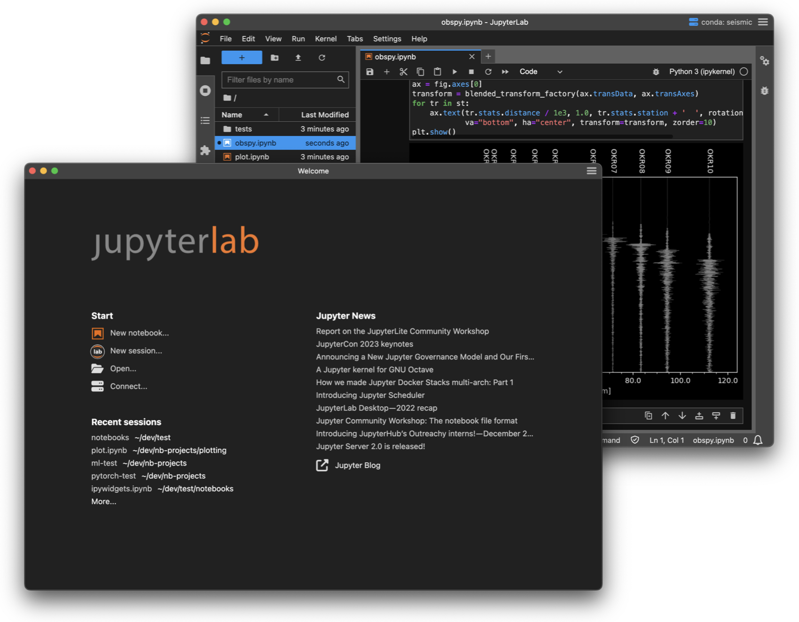
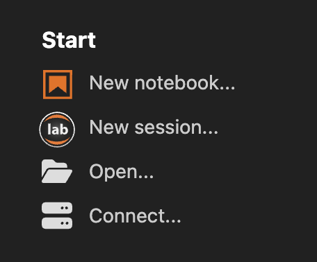

# Open Jupyter

Open Jupyter is a community fork branding of the [JupyterLab Desktop](https://github.com/jupyterlab/jupyterlab-desktop) codebase. It is distributed as a **separate application** (`appId` `org.openjupyter.desktop`, npm name `open-jupyter`) so it does not replace or conflict with an existing official JupyterLab Desktop install on the same machine (separate user data, logs, and installers).

> [!NOTE]
> Upstream JupyterLab Desktop maintenance status and security posture are described in the [official project](https://github.com/jupyterlab/jupyterlab-desktop). Evaluate risk before using any desktop Jupyter distribution with sensitive data.

Open Jupyter is the cross-platform desktop shell for [JupyterLab](https://github.com/jupyterlab/jupyterlab). It remains the quickest way to get started with notebooks locally, with advanced workflows when you need them.

## Installation

Install Open Jupyter from this repository’s releases (replace the org/repo in URLs if you host your own fork).

| Windows (10, 11)                                                                                                                                   | Mac (macOS 10.15+)                                                                                                                                   | Linux                                                                                                                                                             |
| --------------------------------------------------------------------------------------------------------------------------------------------------- | ---------------------------------------------------------------------------------------------------------------------------------------------------- | ----------------------------------------------------------------------------------------------------------------------------------------------------------------- |
| [x64 Installer](https://github.com/open-jupyter/open-jupyter/releases/latest/download/open-jupyter-Setup-Windows-x64.exe)                          | [arm64 Installer (Apple silicon)](https://github.com/open-jupyter/open-jupyter/releases/latest/download/open-jupyter-Setup-macOS-arm64.dmg)           | Build or use artifacts from [Releases](https://github.com/open-jupyter/open-jupyter/releases); Snap packaging may use a different store id than upstream.          |
|                                                                                                                                                     | [x64 Installer (Intel chip)](https://github.com/open-jupyter/open-jupyter/releases/latest/download/open-jupyter-Setup-macOS-x64.dmg)                 | [.deb x64 (Debian, Ubuntu)](https://github.com/open-jupyter/open-jupyter/releases/latest/download/open-jupyter-Setup-Debian-x64.deb)                                |
|                                                                                                                                                     |                                                                                                                                                      | [.rpm x64 (Red Hat, Fedora, SUSE)](https://github.com/open-jupyter/open-jupyter/releases/latest/download/open-jupyter-Setup-Fedora-x64.rpm)                        |

Windows installs may also be published to WinGet under identifier `OpenJupyter.OpenJupyter` once the package manifest is accepted.

If you need to remove Open Jupyter, follow the [uninstall instructions](user-guide.md#uninstalling-open-jupyter).

## Launching Open Jupyter

Launch from the OS application menu, or use the `jlab` CLI where the installer provides it. Double-clicking `.ipynb` files is supported when file associations are registered.

Open Jupyter sets the file browser root according to how you start the app:

- From the icon or `jlab` with no path, the default working directory is used (home by default; configurable in Settings).
- From a file path, `jlab` with a notebook/script, or drag–drop, the file’s parent directory becomes the root.
- With a directory argument or `--working-dir`, that directory is the root.

## Sessions and Projects

Sessions cover local launches and connections to existing JupyterLab servers. Each JupyterLab UI window is one session; recents can be restored.

### Session start options

- `New notebook...` — new notebook in the default working directory.
- `New session...` — new JupyterLab session in the default directory.
- `Open...` — session in a chosen directory or with chosen files (Windows/Linux may split folder vs files).
- `Connect...` — attach to an existing local or remote JupyterLab server.

### `jlab` examples

- `jlab .`, `jlab ../notebooks`, `jlab /path/to/project`
- `jlab notebook.ipynb`, `jlab --python-path /path/to/python notebook.ipynb`
- `jlab https://example.org/lab?token=abcde`

See [CLI documentation](cli.md).

### JupyterLab extension support

User-installed [prebuilt](https://jupyterlab.readthedocs.io/en/stable/extension/extension_dev.html#overview-of-extensions) extensions are supported; source extensions that require a lab rebuild are not.

### Guides

- [User guide](user-guide.md)
- [Python environment management](python-env-management.md)
- [Troubleshooting](troubleshoot.md)
- [Developer documentation](dev.md)
